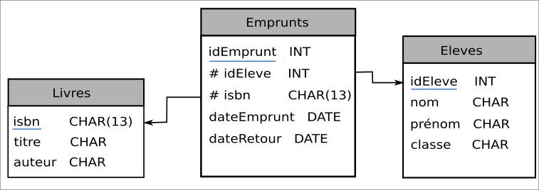
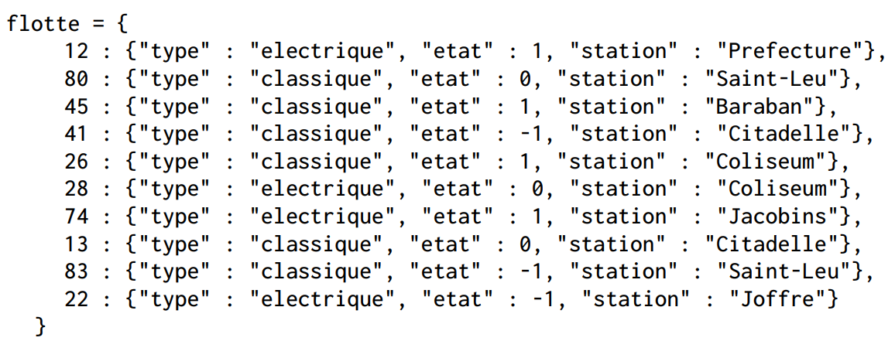

.. TNSI

Exercices sur le modèle relationnel
===================================

.. toctree::
   :maxdepth: 1

Exercice 
---------

On considère dans cet exercice une gestion simplifiée des emprunts des ouvrages d’un CDI. La base de données utilisée
est constituée de trois relations (ou tables) nommées Eleves, Livres et Emprunts selon le schéma relationnel suivant:

Dans ce schéma relationnel, un attribut souligné indique qu’il s’agit d’une clef primaire. Le symbole # devant un
attribut indique qu’il s’agit d’une clef étrangère et la flèche associée indique l’attribut référencé.

#. Donner les clefs primaires de chaque relation.

#. Quelles sont les clefs étrangères de cette base de données. Que référencent-elles ?

#. Dans la relation élèves, on souhaite insérer les valeurs suivantes:

   - (128, ’Dupont’, ’Jean’, ’TNSI’)
   - (200, ’Dupont’, ’Jean’, ’TNSI’)
   - (128, ’Dubois’, ’Jean’, ’TNSI’)

   Cette insertion génère-t-elle une erreur ? Expliquer.

#. Dans la définition de la relation Emprunts, qu’est-ce qui assure qu’on ne peut pas enregistre un emprunt pour un
   élève qui n’a pas encore été inscrit dans la relation Eleves?

.. _exercice-1:

Exercice 
---------

On considère la table de données Films suivante :

.. container:: center

   .. csv-table::
      :file: ../csv/films.csv
      :header: Titre, Année, Réalisateur, Note, NbAvis, Durée, Type
      :delim: ;

.. container:: flushright

   *source https://www.imdb.com*

#. Proposer un modèle relationnel pour ces données.

#. Donner le contenu de chacune des tables.

.. _exercice-2:

Exercice 
---------

On donne les extraits de trois relations d’une base de données:

-  Relation **client**

   .. csv-table::
      :file: ../csv/relation_client.csv
      :header: IdCt, Nom, Adresse, Mail
      :delim: ;

-  Relation **produit**

   .. csv-table::
      :file: ../csv/relation_produit.csv
      :header: IdProduit, CodeProduit, NomProduit, Prix, Stock
      :delim: ;

-  Relation **commande** pour un jour J :

   .. csv-table::
      :file: ../csv/relation_commande.csv
      :header: IdCmd, IdClient, IdProduit, Quantité, Expedié
      :delim: &

#. Donner le schéma relationnel de cette base de données.

#. Dans la relation **commande** quelle est la clef primaire ? Quelles
   sont les clefs étrangères ?

#. A combien s’élève le montant total des commandes de la journée J ?

#. Quels sont les noms des clients pour lesquels la commande a été
   expédiée ?

.. _exercice-3:

Exercice 
---------

Une ville souhaite gérer son parc de vélos en location partagée.
L’ensemble de la flotte de vélos est stocké dans une table de données
représentée en langage Python par un dictionnaire contenant des
associations de type id_velo : dict_velo où id_velo est un nombre entier
compris entre 1 et 199 qui correspond à l’identifiant unique du vélo et
dict_velo est un dictionnaire dont les clés sont : "type", "etat",
"station".

Les valeurs associées aux clés "type", "etat", "station" de dict_velo
sont de type chaînes de caractères ou nombre entier :

-  "type" : chaîne de caractères qui peut prendre la valeur "electrique"
   ou "classique".

-  "état" : nombre entier qui peut prendre la valeur 1 si le vélo est
   disponible, 0 si le vélo est en déplacement ou -1 si le vélo est en
   panne.

-  "station" : chaînes de caractères qui identifie la station où est
   garé le vélo.

Dans le cas où le vélo est en déplacement ou en panne, "station"
correspond à celle où il a été dernièrement stationné.

Voici un extrait de la table de données :

Toutes les questions de cet exercice se réfèrent à l’extrait de la table flotte fourni ci-dessus.

#. 

   a) Que renvoie l’instruction flotte[26] ?

   b) Que renvoie l’instruction flotte[80]["etat"] ?

   c) Que renvoie l’instruction flotte[99]["etat"]

#. Voici le script d’une fonction:

   .. image:: ../img/exercice_bac2.png
      :alt: image
      :align: center
      :width: 450

   a) Quelles sont les valeurs possibles de la variable choix?

   b) Expliquer ce que renvoie la fonction lorsque l’on choisit comme paramètre l’une des valeurs possibles de la
      variable choix.

#. 

   a) Écrire un script en langage Python qui affiche les identifiants (id_velo) de tous les vélos disponibles à la
      station "Citadelle".

   b) Écrire un script en langage Python qui permet d’afficher l’identifiant (id_velo) et la station de tous les vélos
      électriques qui ne sont pas en panne.

#. On dispose d’une table de données des positions GPS de toutes les stations, dont un extrait est donné ci-dessous.
   Cette table est stockée sous la forme d’un dictionnaire.

   .. image:: ../img/stations_gps.png
      :alt: image
      :align: center
      :width: 360
      :class: b-8

   Chaque élément du dictionnaire est du type: ’nom de la station’ : (latitude, longitude)

   On **admet** que l’on dispose d’une fonction distance(p1, p2) permettant de renvoyer la distance en mètres entre
   deux positions données par leurs coordonnées GPS (latitude et longitude).

   Cette fonction prend en paramètre deux tuples représentant les coordonnées des deux positions GPS et renvoie un
   nombre entier représentant cette distance en mètres.

   Par exemple, distance((49.8905, 2.2967), (49.8912, 2.3016)) renvoie 9591.

   **Écrire** une fonction qui prend en paramètre les coordonnées GPS de l’utilisateur sous forme d’un tuple et qui
   renvoie, pour chaque station située à moins de 800 mètres de l’utilisateur :

   -  le nom de la station ;

   -  la distance entre l’utilisateur et la station ;

   -  les identifiants des vélos disponibles dans cette station.

   Une station où aucun vélo n’est disponible ne doit pas être affichée.
